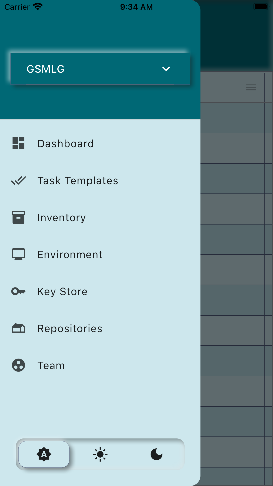
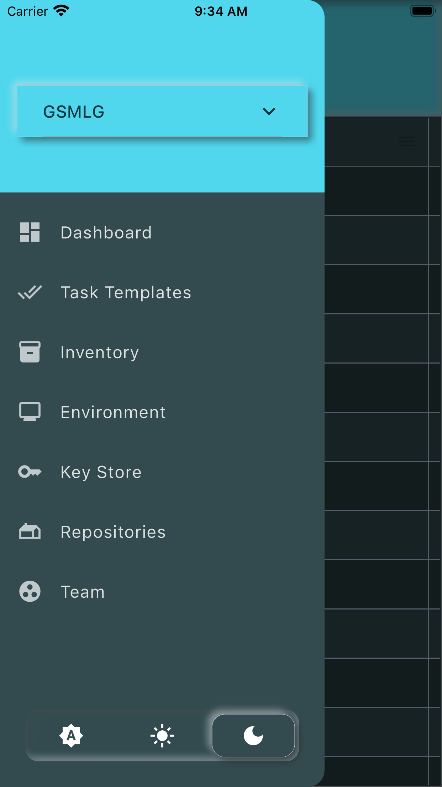
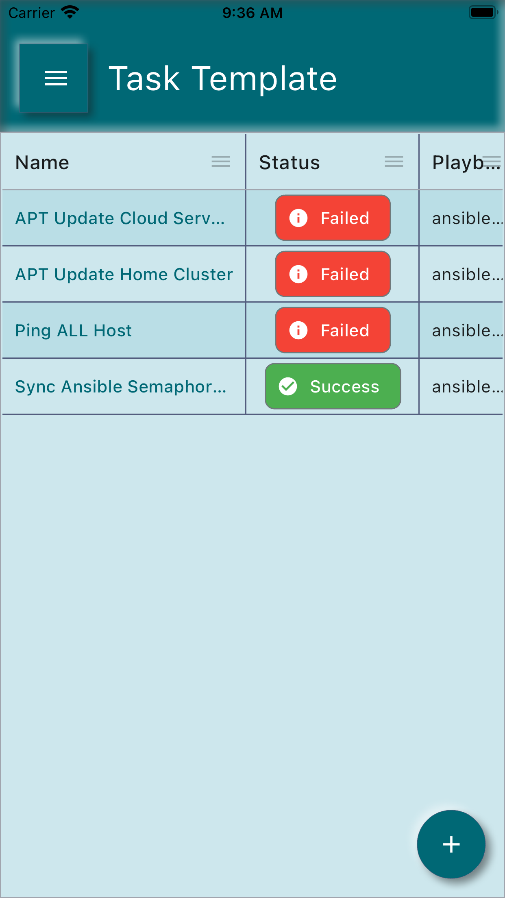
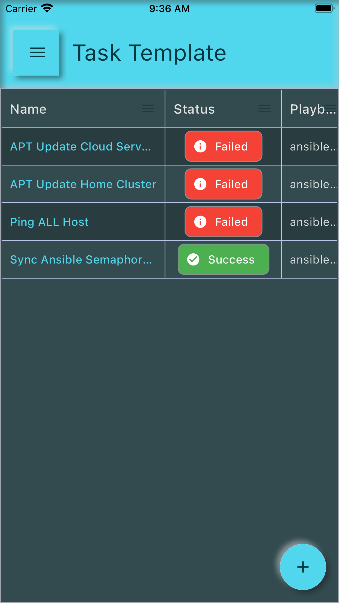

# Ansible Sempahore Client

Run ansible task from your phone.

## Getting Started

Download from

- [AppStore]()
- [PlayStore](https://play.google.com/store/apps/details?id=org.gsmlg.semaphore)
- [F-Droid]()

## Screens

Light Mode           |  Dark Mode
:-------------------------:|:-------------------------:
 | 
 | 
